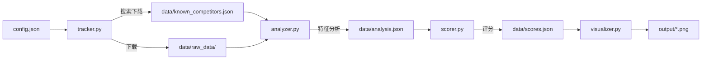

# CodeScope

> GitHub 代码理解工具自动化竞品分析系统
> 
> 输入关键词，自动搜索同类代码理解工具、提取特征、评分排名、输出可视化报告
> 纯 Python 实现，无第三方依赖（除 matplotlib 可视化外）

---

## 快速开始

### 1. 前置要求
- Python 3.8+
- pip install -r requirements.txt
- 网络能访问 api.github.com 和 raw.githubusercontent.com

### 2. 运行完整流水线
```powershell
cd codescope
python engine.py
```

### 3. 单独运行各模块
```powershell
python scripts/tracker.py      # 仅搜索下载
python scripts/analyzer.py     # 仅分析已下载
python scripts/scorer.py       # 仅评分
python scripts/visualizer.py   # 仅出图
```

---

## 目录结构

```
codescope/
├── engine.py              # 主控入口，四步流水线串联
├── scripts/               # 各模块实现
│   ├── tracker.py         # GitHub 搜索 + 下载 README
│   ├── analyzer.py        # README 特征提取
│   ├── scorer.py          # 四维评分（可自定义权重）
│   └── visualizer.py      # Matplotlib 可视化
├── requirements.txt       # 依赖清单
│
└── data/                  # 配置和数据目录
    ├── config.json         # 配置文件（关键词/路径/权重）
    ├── skipped_repos.json  # 黑名单（自动+手动）
    ├── raw_data/          # 下载的 README.md（gitignore）
    ├── known_competitors.json  # 已追踪仓库元数据（gitignore）
    ├── analysis.json      # 特征分析结果（gitignore）
    └── scores.json        # 评分排名结果（gitignore）

output/                    # 图表输出目录（gitignore）
    ├── top_scores_bar.png
    ├── setup_vs_total_scatter.png
    ├── dimension_comparison.png
    └── top5_radar.png
```

---

## 四步流水线

| 步骤 | 模块 | 职责 | 负责人 | 输入 | 输出 |
|:----:|------|------|:------:|------|------|
| 1 | `tracker.py` | GitHub Search API 搜索 → 去重 → 下载 README | [@tbode-l](https://github.com/tbode-l) | config.json | data/known_competitors.json + data/raw_data/ |
| 2 | `analyzer.py` | 读取 README，提取特征 | [@tbode-l](https://github.com/tbode-l) | data/known_competitors.json + data/raw_data/ | data/analysis.json |
| 3 | `scorer.py` | 四维评分，可自定义权重 | [@hfycium](https://github.com/hfycium) | data/analysis.json | data/scores.json |
| 4 | `visualizer.py` | 生成 4 张图表 + 终端报告 | [@hfycium](https://github.com/hfycium) | data/scores.json | output/*.png |



---

## 配置文件

### config.json 字段说明

| 字段 | 说明 |
|------|------|
| `search_queries` | GitHub Search API 查询列表 |
| `max_per_query` | 单次搜索返回上限（最大 100） |
| `total_download_limit` | 本次最多下载几个新仓库 |
| `github_token` | GitHub PAT（推荐） |
| `paths` | 生成文件路径配置 |
| `scoring_weights` | 评分权重配置 |

### 自定义评分权重

用户可修改 `config.json` 中的 `scoring_weights`：

```json
{
  "attention": 25,
  "tech_advancement": 30,
  "setup_product": 30,
  "ecosystem_openness": 15
}
```

权重不要求加起来等于 100，程序会自动归一化。

**字段含义：**
| 字段 | 含义 | 适合提高权重的场景 |
|------|------|------|
| `attention` | 关注度，看 stars/forks/issues | 想找成熟、热门工具 |
| `tech_advancement` | 技术先进性，看 README 中的 Agent/RAG/插件等关键词 | 想找新技术、智能化工具 |
| `setup_product` | 配置门槛与产品形态，看安装复杂度 + CLI/IDE/插件形态 | 想找易用、开箱即用的工具 |
| `ecosystem_openness` | 生态开放性，看 API/SDK/插件扩展支持 | 想找可扩展、可二次开发的工具 |

### 自定义文件路径

所有生成文件路径由 `config.json` 统一管理：

```json
{
  "paths": {
    "known_competitors": "data/known_competitors.json",
    "raw_data_dir": "data/raw_data",
    "analysis": "data/analysis.json",
    "scores": "data/scores.json",
    "output_dir": "output"
  }
}
```

### Token 配置（推荐）

1. GitHub → Settings → Developer settings → Personal access tokens → Fine-grained tokens
2. 权限勾选 `public_repo`（只读即可）
3. 填入 `config.json` 或设环境变量 `$env:GITHUB_TOKEN="ghp_xxxx"`

| 认证状态 | 搜索限额 | API 限额 |
|:-------|:-------:|:-------:|
| 未认证 | 10 次/分钟 | 60 次/小时 |
| 已认证 | 30 次/分钟 | 5000 次/小时 |

---

## 黑名单机制

`skipped_repos.json` 是黑名单，用于排除已知的不相关仓库（如机器人比赛、教程、白皮书等）。

### 自动黑名单
`analyzer.py` 在分析时会自动检测垃圾仓库（通过仓库名、描述、README 关键词），命中后：
1. 打印 `[黑名单] 自动加入 xxx（原因：yyy）`
2. 自动加入 `skipped_repos.json`
3. **不进入 analysis.json**（跳过后续评分/可视化）

### 人工黑名单
除了自动检测，你也可以手动编辑 `skipped_repos.json` 添加人工黑名单。

### 完整流程
1. 首次运行 `python engine.py`
2. 自动检测到的垃圾仓库会被自动加入
3. 查看 `data/analysis.json`，找出漏掉的垃圾仓库
4. 把仓库名加到 `skipped_repos.json`
5. 再次运行 `python engine.py` 时自动跳过

### 格式示例
```json
{
  "chrisneagu/FTC-Skystone-Dark-Angels-Romania-2020": {
    "reason": "检测到关键词：ftc",
    "skipped_at": "2026-06-06"
  }
}
```

**说明：**
- 固定在项目根目录，不受 config.json 路径配置影响
- 永不被程序覆写，安全可靠
- tracker.py 在搜索去重后、下载前检查
- analyzer.py 在分析前自动检测并加入

---

## 成员分工

| 成员 | 负责模块 |
|------|----------|
| [@tbode-l](https://github.com/tbode-l) | tracker.py + analyzer.py + engine.py + 论文全文 |
| [@hfycium](https://github.com/hfycium) | scorer.py + visualizer.py + PPT |

---

## 许可证

[MIT](LICENSE) © 2026 CodeScope Authors
